# react-apps

A collection of apps made in React.js

|    Expense Tracker   |    Todo App     |             
| :---------: | :-----------: |    
| 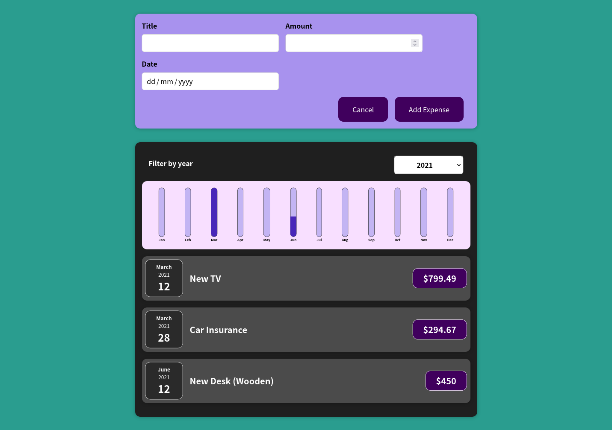 | 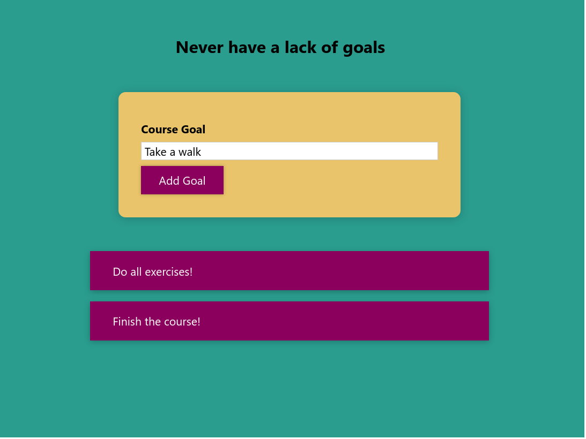 |    
| Basics of React with components, lists, conditional content & state management | React styling, Styled Components & debugging |        
 
|   Users List   |    Simple Login  |   
| :------------: | :-------------: |     
| 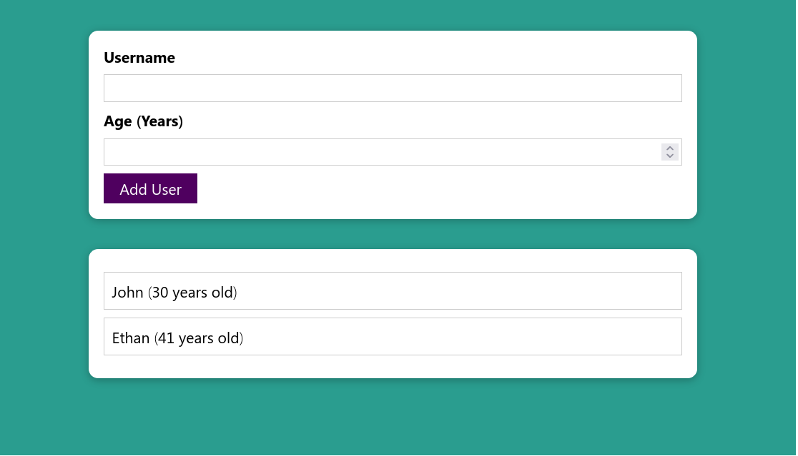 | 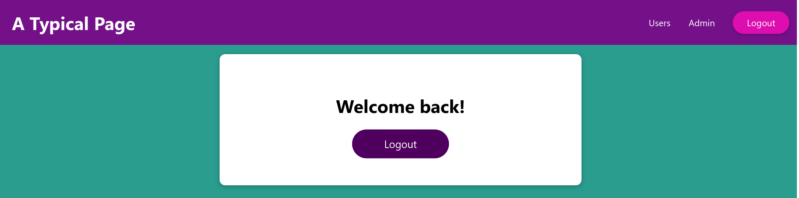 |
| Practice Project with Fragments, Portals & Refs | Side Effects, Reducers & Context API |           
 
| Food Order |  Simple List |         
| :------------: | :-------------: |            
| 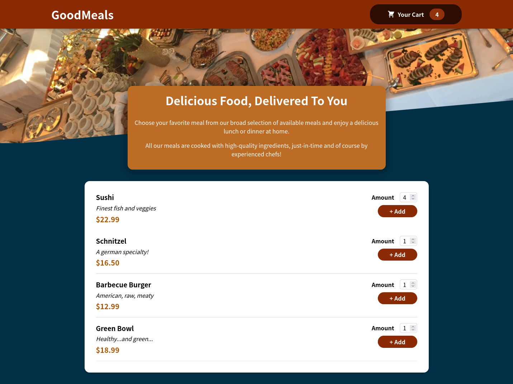 | 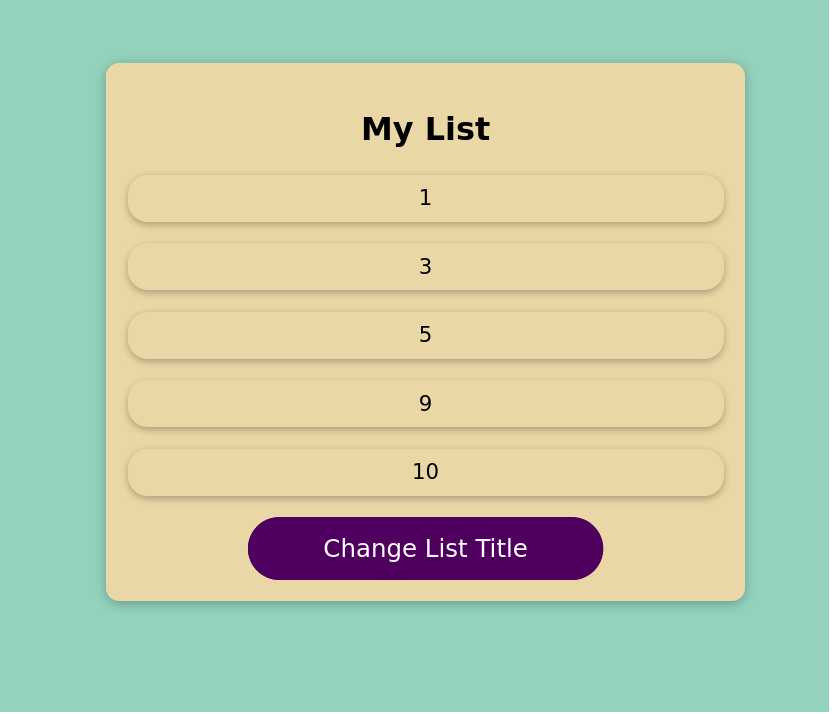 |   
| Practice Project | useCallback, useMemo & State Scheduling |               

| Search Users |  Movies List |              
| :------------: | :---------------: |               
| 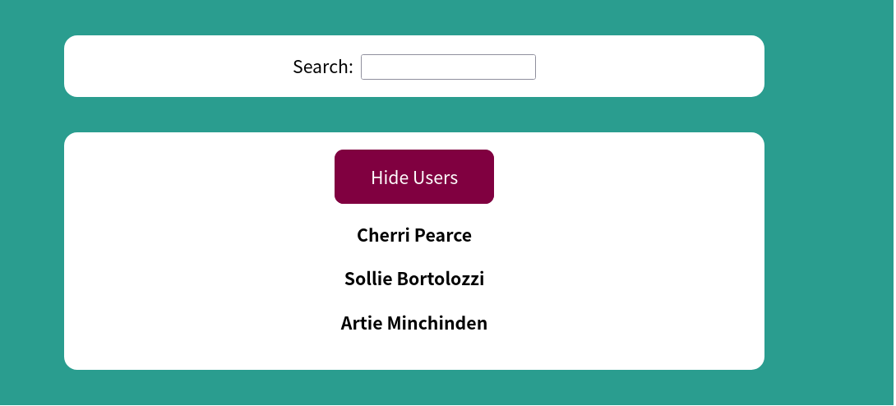 |  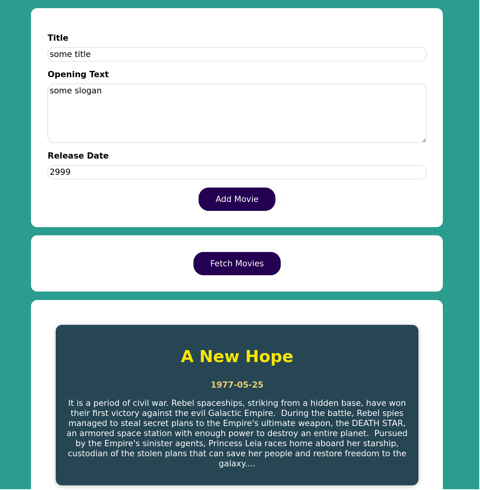  |  
| Class-based components & Lifecycle Methods | HTTP Requests |         

| Tasks List | Simple Form |                 
| :----------------: | :--------------------: |                 
| 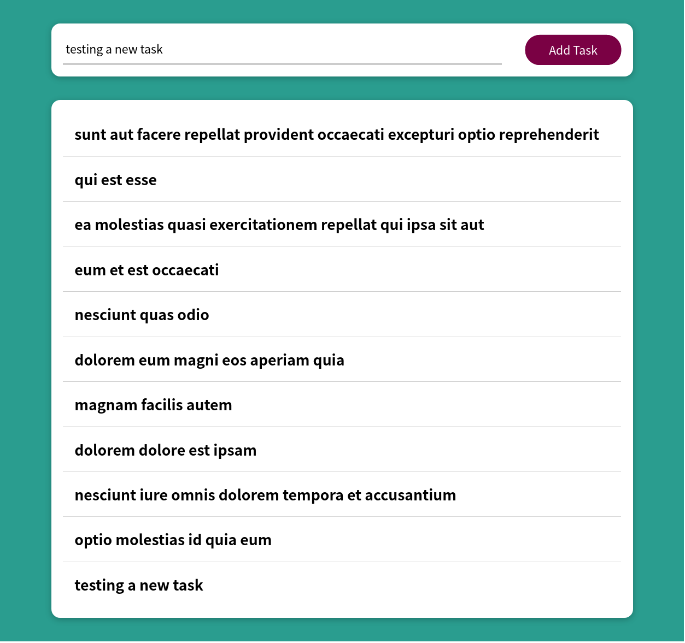 | 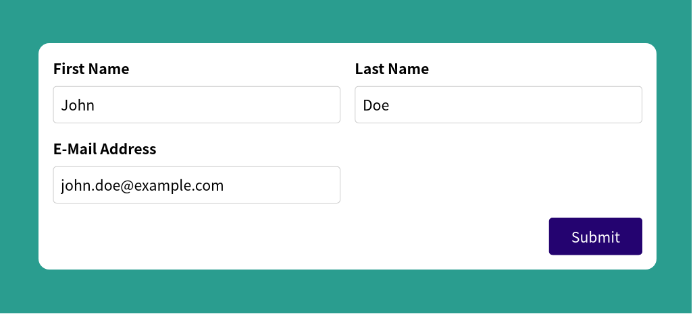 |                    
| Custom React Hooks | Forms & User Input |                   

| Random Users |  Login Counter |         
| :------------: | :-------------: |            
| 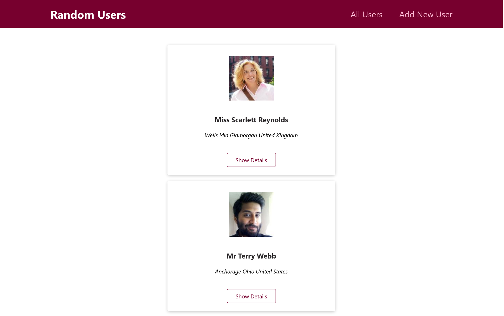 | 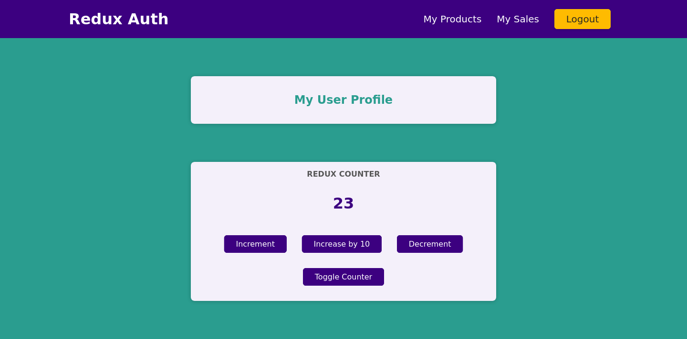 |   
| Next.js basics | Redux and Redux Toolkit |      

| Product Cart |                       
| :----------------: |                        
|  |                            
| Side-effects, Async tasks in Redux and Thunks |                                  
 

<!-- LICENSE -->

## License

Distributed under the MIT License.
