

[![Contributors][contributors-shield]][contributors-url]
[![Forks][forks-shield]][forks-url]
[![Stargazers][stars-shield]][stars-url]
[![Issues][issues-shield]][issues-url]

 

<h3 align="center">React Apps</h3>

  

    A collection of apps made in React.js
     
     
    <a href="https://github.com/vijethph/react-apps/issues">Report Bug</a>
    ·
    <a href="https://github.com/vijethph/react-apps/issues">Request Feature</a>
  

<!-- TABLE OF CONTENTS -->

  
Table of Contents

  <ol>
    <li>
      <a href="#about-the-project">About The Project</a>
      <ul>
        <li><a href="#built-with">Built With</a></li>
      </ul>
    </li>
    <li><a href="#list-of-apps">List of Apps</a></li>
    <li><a href="#license">License</a></li>
    <li><a href="#contact">Contact</a></li>
    <li><a href="#acknowledgments">Acknowledgments</a></li>
  </ol>

<!-- ABOUT THE PROJECT -->
## About The Project

A collection of apps made in React.js

### Built With

* [![React][React]][react-url]
* [![Redux][Redux]][redux-url]
* [![Next.js][Next.js]][nextjs-url]

(<a href="#readme-top">back to top</a>)

<!-- SCREENSHOTS -->
## Screenshots

|    Expense Tracker   |    Todo App     |             
| :---------: | :-----------: |    
|  |  |    
| Basics of React with components, lists, conditional content & state management | React styling, Styled Components & debugging |        
 
|   Users List   |    Simple Login  |   
| :------------: | :-------------: |     
|  |  |
| Practice Project with Fragments, Portals & Refs | Side Effects, Reducers & Context API |           
 
| Food Order |  Simple List |         
| :------------: | :-------------: |            
|  |  |   
| Practice Project | useCallback, useMemo & State Scheduling |               

| Search Users |  Movies List |              
| :------------: | :---------------: |               
|  |    |  
| Class-based components & Lifecycle Methods | HTTP Requests |         

| Tasks List | Simple Form |                 
| :----------------: | :--------------------: |                 
|  |  |                    
| Custom React Hooks | Forms & User Input |                   

| Random Users |  Login Counter |         
| :------------: | :-------------: |            
|  |  |   
| Next.js basics | Redux and Redux Toolkit |      

| Product Cart | Simple Quotes |                                 
| :----------------: | :-------------: |                               
|  | 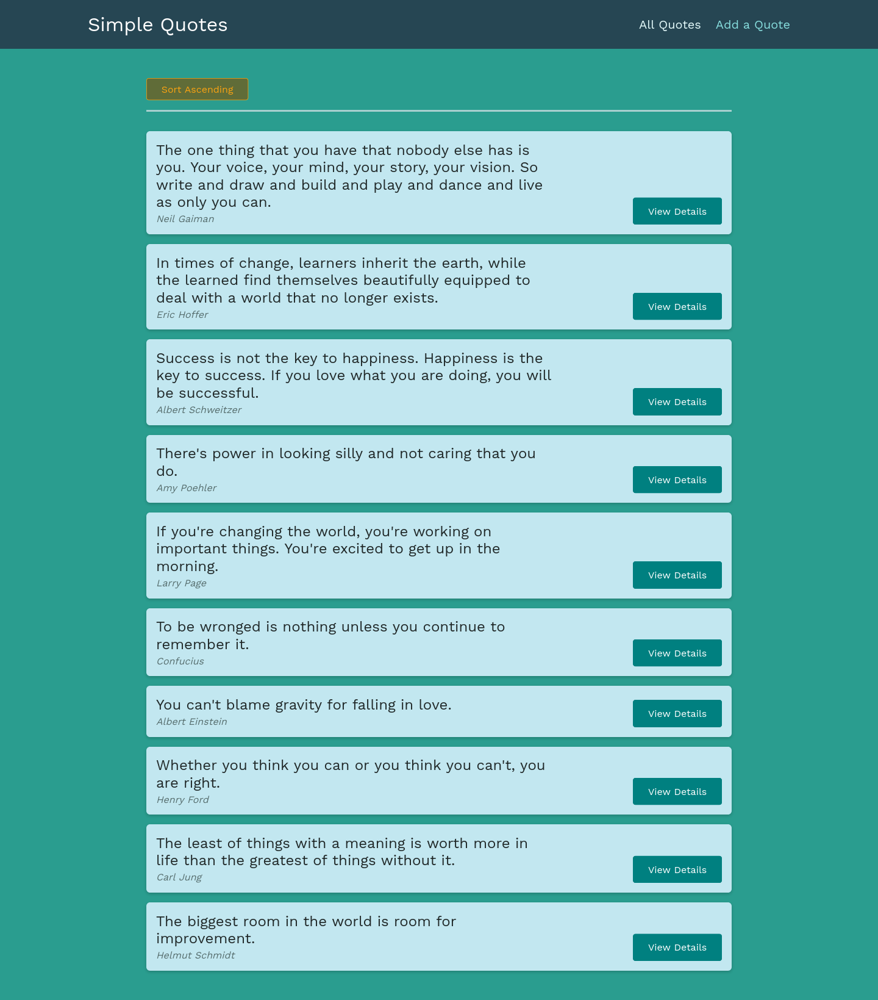 |                                 
| Side-effects, Async tasks in Redux and Thunks | React Router v5 & v6 |     

| Simple Auth  | Simple Animations |                
| :------------: | :--------------: |                  
| 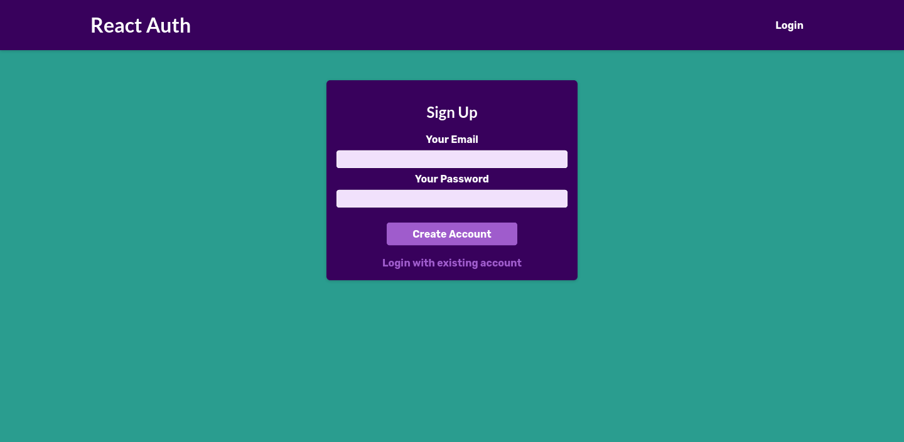  | 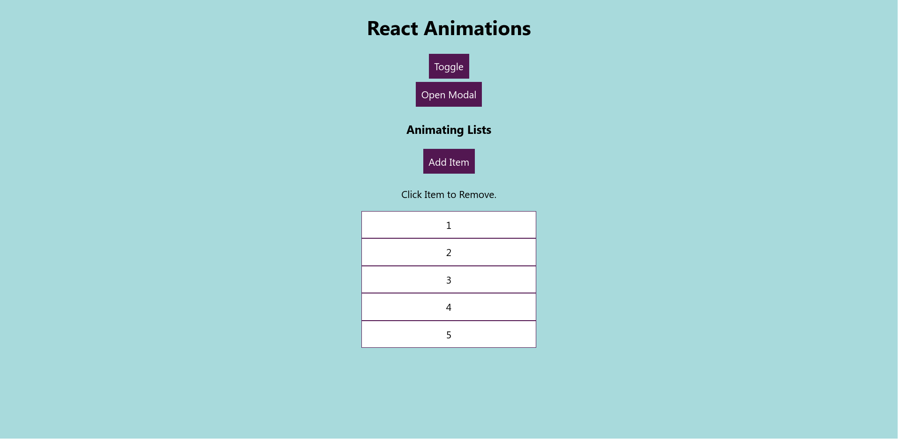 |             
| Authentication & Navigation Guards | CSS Transitions & Animations |         

| Products List | Simple Tests |            
| :------------: | :--------------: |                             
| 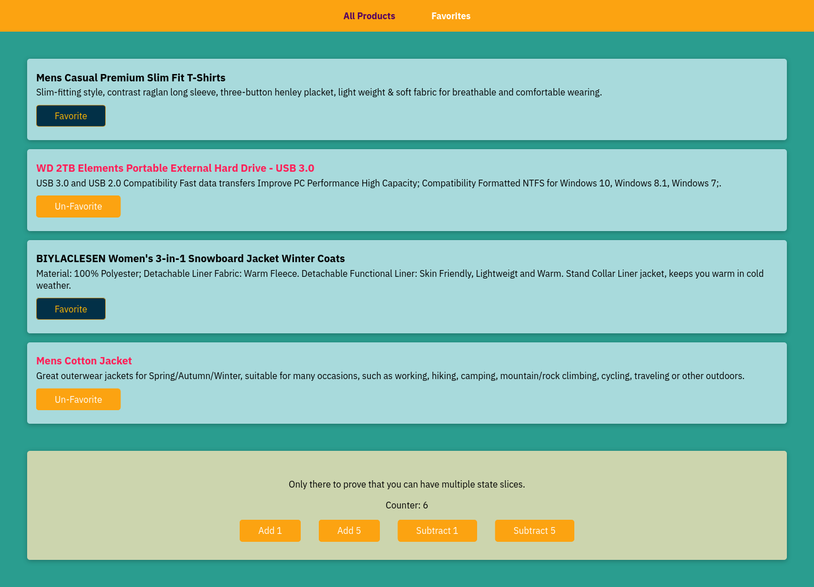  |  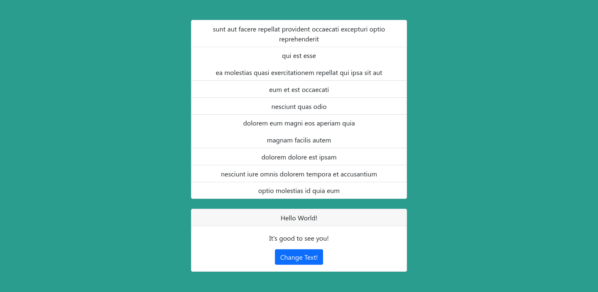 |                                        
| Replacing Redux with React Hooks | Testing & Mocks |       

| React Typescript | Simple Ingredients |                      
| :------------: | :--------------: |                      
| 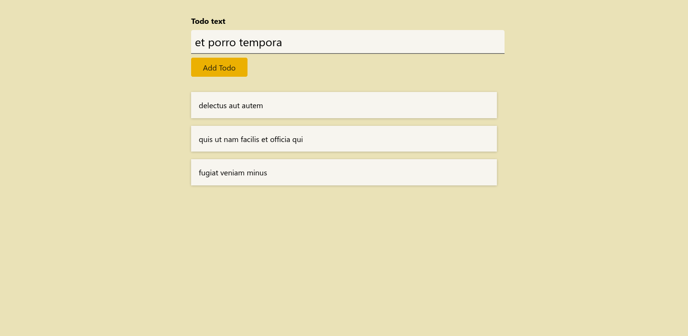 | 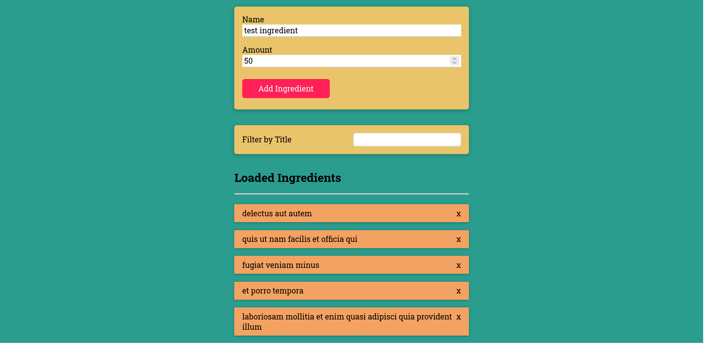 |                              
| Typescript Basics | Practice Project |         

| Events List | Simple Posts |                 
| :------------: | :--------------: |                                  
| 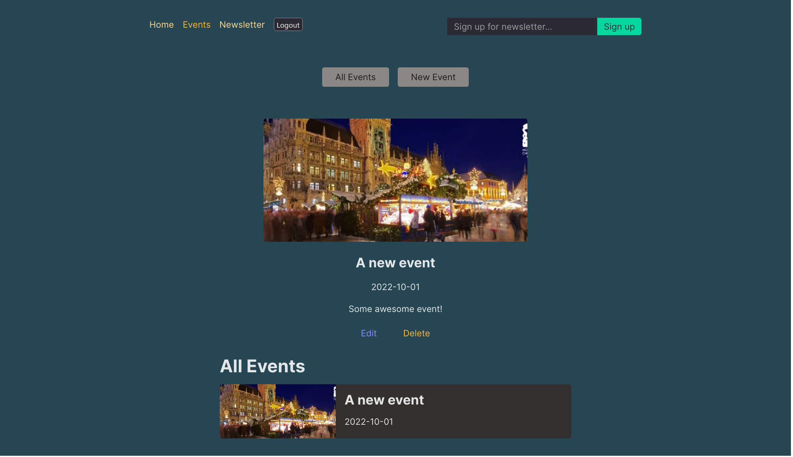  |  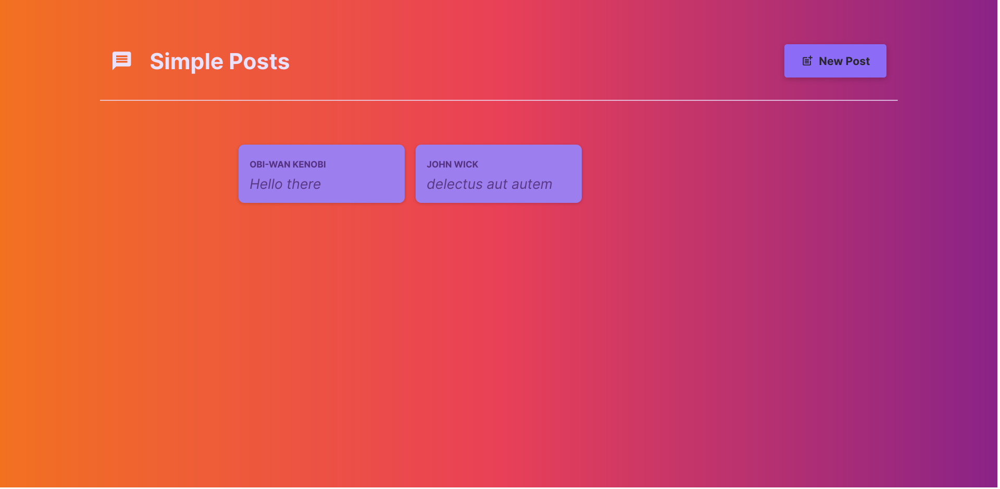 |                                            
| React Router v6 | Practice Project |    

| Investments Calculator | Simple Challenges |                 
| :------------: | :--------------: |                                  
| 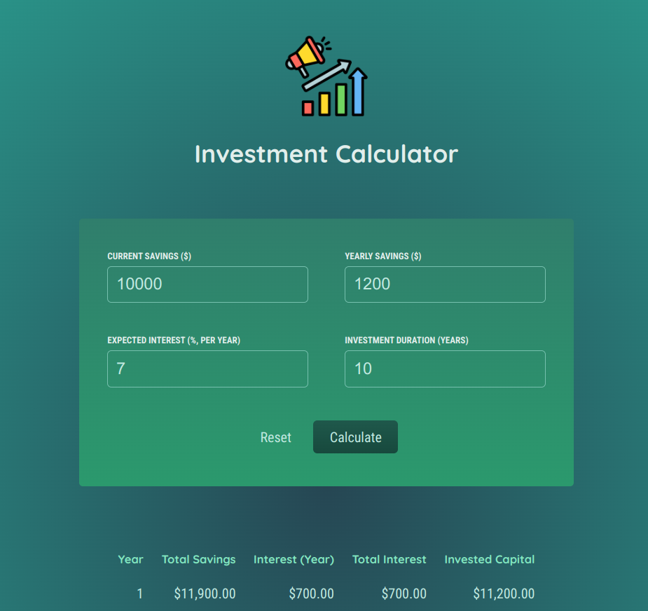  |  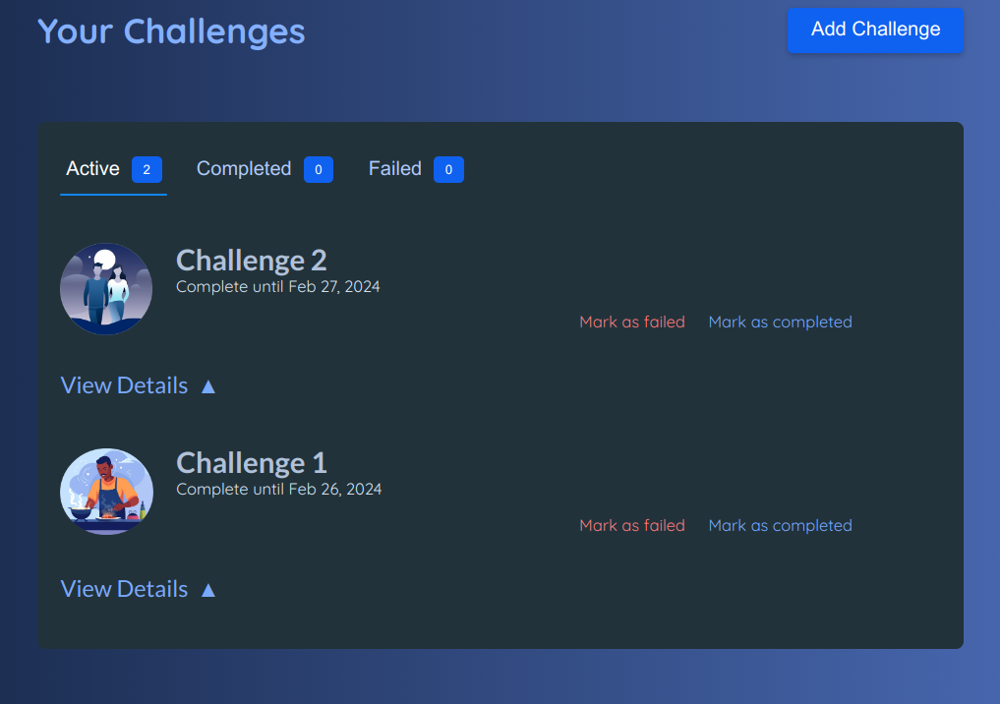 |                                            
| Practice Project | Framer Motion Animations |    

| Simple Events | Simple Meals |                 
| :------------: | :--------------: |                                        
| 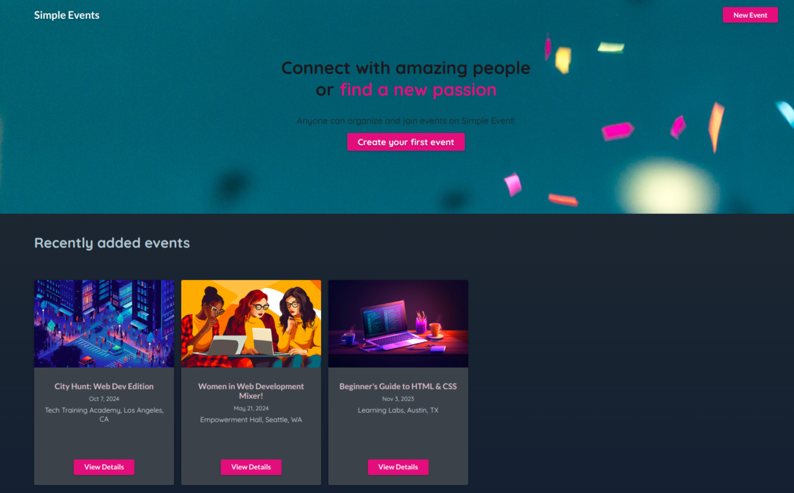  |   |                                                                                        
| TanStack Query | NextJS App Router |                                                                                   

(<a href="#readme-top">back to top</a>)

<!-- LICENSE -->
## License

Distributed under the MIT License. See `LICENSE.txt` for more information.

<!-- CONTACT -->
## Contact

Vijeth P H - [@vijethph](https://github.com/vijethph)

Project Link: [https://github.com/vijethph/react-apps](https://github.com/vijethph/react-apps)

(<a href="#readme-top">back to top</a>)

## Acknowledgements

- [React - The Complete Guide by Maximilian Schwarzmüller](https://www.udemy.com/course/react-the-complete-guide-incl-redux/)
- [React Docs](https://reactjs.org/docs/getting-started.html)
- [React Router Docs](https://reactrouter.com/en/main)
- [Redux Docs](https://redux.js.org/)

(<a href="#readme-top">back to top</a>)

<!-- MARKDOWN LINKS & IMAGES -->
<!-- https://www.markdownguide.org/basic-syntax/#reference-style-links -->
[contributors-shield]: https://img.shields.io/github/contributors/vijethph/react-apps.svg?style=flat-square
[contributors-url]: https://github.com/vijethph/react-apps/graphs/contributors
[forks-shield]: https://img.shields.io/github/forks/vijethph/react-apps.svg?style=flat-square
[forks-url]: https://github.com/vijethph/react-apps/network/members
[stars-shield]: https://img.shields.io/github/stars/vijethph/react-apps.svg?style=flat-square
[stars-url]: https://github.com/vijethph/react-apps/stargazers
[issues-shield]: https://img.shields.io/github/issues/vijethph/react-apps.svg?style=flat-square
[issues-url]: https://github.com/vijethph/react-apps/issues
[React]: https://img.shields.io/badge/react-%2320232a.svg?style=for-the-badge&logo=react&logoColor=%2361DAFB
[react-url]: https://react.dev/
[Redux]: https://img.shields.io/badge/redux-%23593d88.svg?style=for-the-badge&logo=redux&logoColor=white
[redux-url]: https://redux.js.org/
[Next.js]: https://img.shields.io/badge/Next-black?style=for-the-badge&logo=next.js&logoColor=white
[nextjs-url]: https://nextjs.org/